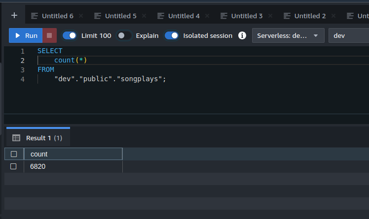

# 5-1-Project-Data-Pipelines
1. [Project Overview](#schema1)
2. [Prerequisites](#schema2)
3. [Project Instructions](#schema3)
4. [Install, run Airflow](#schema4)
5. [Project Details](#schema5)
6. [Building the operators](#schema6)
7. [Stage Operator](#schema7)
8. [Fact and Dimension Operators](#schema8)
9. [Data Quality Operator](#schema9)
10. [REF](#schemaref)

<hr>
<a name='schema1'></a>


## 1. Project Overview
This project will introduce you to the core concepts of Apache Airflow. To complete the project, you will need to 
create your own custom operators to perform tasks such as staging the data, filling the data warehouse, and running 
checks on the data as the final step.


<hr>
<a name='schema2'></a>


## 2. Prerequisites

**Prerequisites**
- Create an IAM User in AWS.
  - Follow the steps on the page Create an IAM User in AWS in the lesson Data Pipelines.
- Configure Redshift Serverless in AWS.
  - Follow the steps on the page Configure Redshift Serverless in the lesson Airflow and AWS. 
**Setting up Connections**
- Connect Airflow and AWS
  - Follow the steps on the page Connections - AWS Credentials in the lesson Airflow and AWS.
  - Use docker check [4-Automate-Data-Pipelines](../4-Automate-Data-Pipelines/README.md)
- Connect Airflow to AWS Redshift Serverless
  - Follow the steps on the page Add Airflow Connections to AWS Redshift in the lesson Airflow and AWS.

<hr>
<a name='schema3'></a>

## 3. Project Instructions


**Datasets**

For this project, you'll be working with two datasets. Here are the s3 links for each:

Log data: `s3://udacity-dend/log_data`

Song data: `s3://udacity-dend/song-data`

Tip: You will want to copy the data to your own bucket.


<hr>
<a name='schema4'></a>

## 4. Install, run Airflow

Follow the steps of: [5-Data-Quality](../5-1-Project-Data-Pipelines/README.md)


<hr>
<a name='schema5'></a>

## 5. Project Details

- Configuring the DAG. In the DAG, add `default parameters` according to these guidelines
  - The DAG does not have dependencies on past runs
  - On failure, the task are retried 3 times
  - Retries happen every 5 minutes
  - Catchup is turned off
  - Do not email on retry


- Building the operators ( Stage Operator, Fact and Dimension Operators, Data Quality Operator)
To complete the project, you need to build four different operators to stage the data, transform the data, 
and run checks on data quality.

All of the operators and task instances will run SQL statements against the Redshift database. However, 
using parameters wisely will allow you to build flexible, reusable, and configurable operators you can later apply 
to many kinds of data pipelines with Redshift and with other databases.


<hr>
<a name='schema6'></a>

## 6. Building the operators


In this project I have used Airflow's built-in functionalities like connections and hooks as much as possible and 
let Airflow do all the heavy lifting when possible.

<hr>
<a name='schema7'></a>

## 7. Stage Operator
The stage operator is expected to be able to load any JSON-formatted files from S3 to Amazon Redshift. 
The operator creates and runs a SQL COPY statement based on the parameters provided. The operator's parameters 
should specify where in S3 the file is loaded and what is the target table.

The parameters should be used to distinguish between JSON files. Another important requirement of the stage 
operator is containing a templated field that allows it to load timestamped files from S3 based on the execution 
time and run backfills.


<hr>
<a name='schema8'></a>

## 8. Fact and Dimension Operators

With dimension and fact operators, you can utilize the provided SQL helper class to run data transformations. 
Most of the logic is within the SQL transformations, and the operator is expected to take as input a SQL statement 
and target database on which to run the query against. You can also define a target table that will contain the 
results of the transformation.

Dimension loads are often done with the truncate-insert pattern, where the target table is emptied before the load. 
Thus, you could also have a parameter that allows switching between insert modes when loading dimensions. 
Fact tables are usually so massive that they should only allow append type functionality.





<hr>
<a name='schema9'></a>

## 9. Data Quality Operator

The final operator to create is the data quality operator, which runs checks on the data itself. The operator's 
main functionality is to receive one or more SQL based test cases along with the expected results and execute the tests.
For each test, the test result and expected result need to be checked, and if there is no match, the operator should 
raise an exception, and the task should retry and fail eventually.

For example, one test could be a SQL statement that checks if a certain column contains NULL values by counting all 
the rows that have NULL in the column. We do not want to have any NULLs, so the expected result would be 0, and the 
test would compare the SQL statement's outcome to the expected result.


<hr>
<a name='schemaref'></a>

## REF:
[Sample song_data](https://knowledge.udacity.com/questions/1002142)

```
aws s3 cp s3://udacity-dend/song_data/A/B/C/TRABCAS128F14A25E2.json ~/song-data/ 
```


